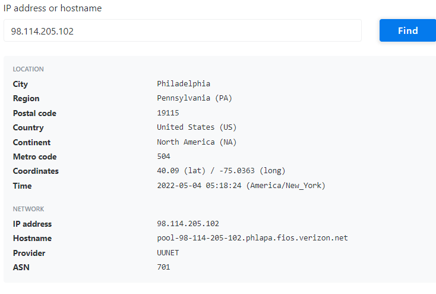
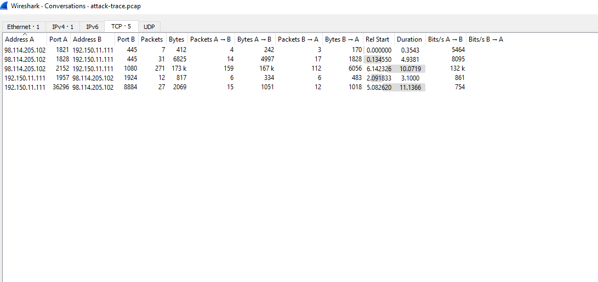
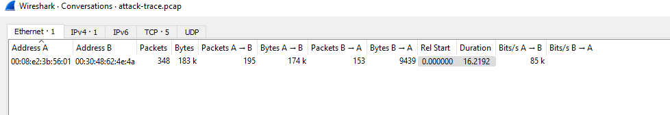

# systems involved:
we can find info about them simply in source and destination columns ,and deeper we can know their mac adress ispecting the frame transit ethernet layer  and even the manufacterer of the mac

# what can you find abt the attacker!?
wa can gather info about ip adress port used and protocol ,his mac adress,system os used ,we can unlock the attacker ip using online tools like:[link](https://tools.keycdn.com/geo?host=192.168.1.2)

or [link](https://www.iplocation.net/)

# How many TCP sessions are contained in the dump file?
 5 session;
 we can find this under statistics window or also under Anylize window menu than follow stream option
 

# How long did it take to perform the attack?
we can find such info in statistic under conversation duration: here was 16.1292 mn

# Which operating system was targeted by the attack? And which service? Which vulnerability?

following the tcp tream window ,we can see that the targeted system is a windows server, and the service targeted is SMB 

